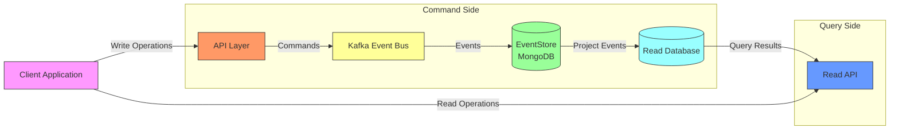

```mermaid
 flowchart LR
    Client[Client Application]
    API[API Layer]
    Kafka[Kafka Event Bus]
    MongoDB[(EventStore\nMongoDB)]
    ReadDB[(Read Database)]
    
    subgraph Command Side
        direction TB
        API --> |Commands| Kafka
        Kafka --> |Events| MongoDB
        MongoDB --> |Project Events| ReadDB
    end
    
    subgraph Query Side
        direction TB
        ReadAPI[Read API]
        ReadDB --> |Query Results| ReadAPI
    end
    
    Client --> |Write Operations| API
    Client --> |Read Operations| ReadAPI
    
    style Client fill:#f9f,stroke:#333
    style Kafka fill:#ff9,stroke:#333
    style MongoDB fill:#9f9,stroke:#333
    style ReadDB fill:#9ff,stroke:#333
    style API fill:#f96,stroke:#333
    style ReadAPI fill:#69f,stroke:#333


```
