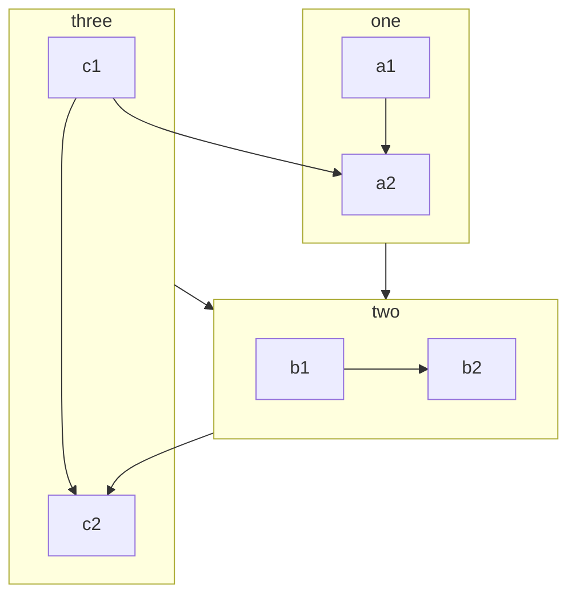

```mermaid
flowchart TD
    subgraph EventStore
    C --> E[Event Stream]
    end
    subgraph MessageBroker
    D --> F[Kafka Topic]
    end
    subgraph Consumers
    F --> G[Event Processor]
    G --> H[Read Model Updater]
    H --> I[Read Model (MongoDB)]
    end
```
