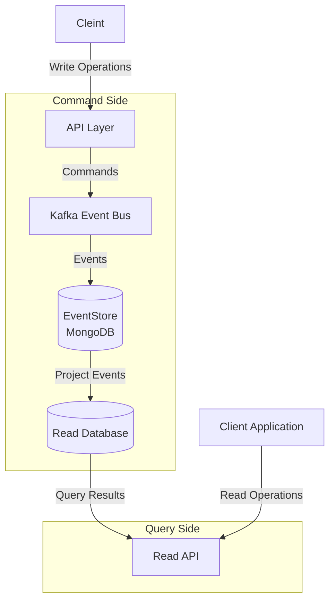

```mermaid
flowchart TB
   Client[Client Application]
   API[API Layer]
   Kafka[Kafka Event Bus]
   MongoDB[(EventStore\nMongoDB)]
   ReadDB[(Read Database)]

   subgraph Command Side
       direction TB
       API --> |Commands| Kafka
       Kafka--> |Events| MongoDB
       MongoDB-->|Project Events| ReadDB
   end

   subgraph Query Side
        direction TB
        ReadAPI[Read API]
        ReadDB-->|Query Results| ReadAPI
   end

   Cleint -->|Write Operations| API
   Client -->|Read Operations| ReadAPI
   


```
