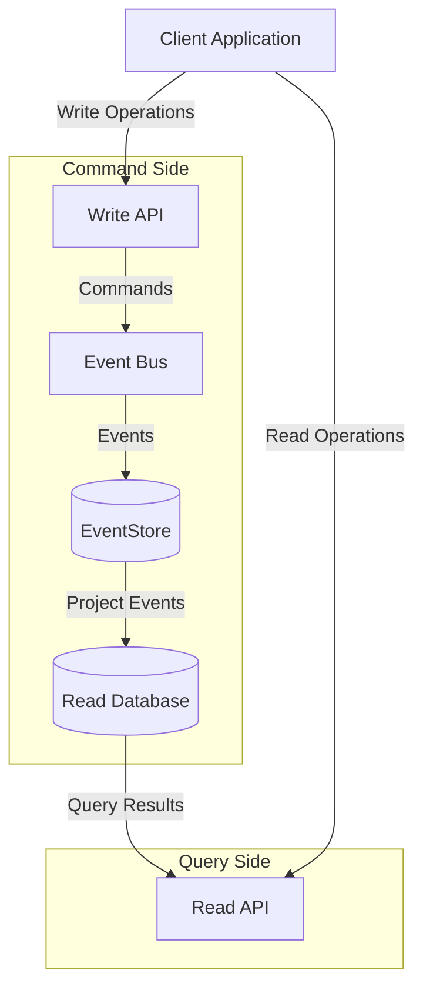

```mermaid
flowchart TB
   Client[Client Application]
   WriteAPI[Write API]
   EventBus[ Event Bus]
   EventStore[(EventStore)]
   ReadDB[(Read Database)]

   subgraph Command Side
       direction TB
       WriteAPI --> |Commands| EventBus
       EventBus--> |Events| EventStore
       EventStore-->|Project Events| ReadDB
   end

   subgraph Query Side
        direction TB
        ReadAPI[Read API]
        ReadDB-->|Query Results| ReadAPI
   end

   Client -->|Write Operations| WriteAPI
   Client -->|Read Operations| ReadAPI
   


```
