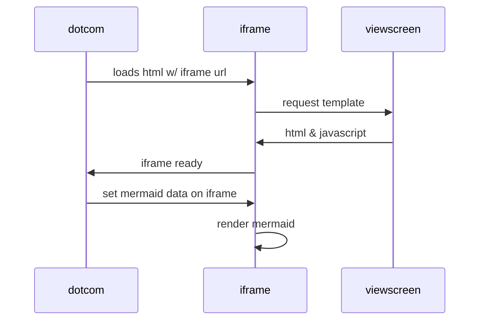

Sure! Here's an example of Mermaid code to generate a flow diagram for an Event Sourcing system in a Quoting Domain using Kafka as the message broker, MongoDB as the event store, and Spring Boot as the application framework:

```mermaid
flowchart TD
    subgraph Application
        A[Spring Boot Application] --> B[Command Handler]
        B --> C[Event Store (MongoDB)]
        B --> D[Message Broker (Kafka)]
    end

    subgraph EventStore
        C --> E[Event Stream]
    end

    subgraph MessageBroker
        D --> F[Kafka Topic]
    end

    subgraph Consumers
        F --> G[Event Processor]
        G --> H[Read Model Updater]
        H --> I[Read Model (MongoDB)]
    end

    style Application fill:#f9f,stroke:#333,stroke-width:4px
    style EventStore fill:#bbf,stroke:#333,stroke-width:4px
    style MessageBroker fill:#bfb,stroke:#333,stroke-width:4px
    style Consumers fill:#ffb,stroke:#333,stroke-width:4px
```

This diagram represents the flow of events in your system:
1. **Spring Boot Application** handles commands and sends events to the **Event Store (MongoDB)** and **Message Broker (Kafka)**.
2. **Kafka** distributes events to various consumers.
3. **Event Processor** processes events and updates the **Read Model (MongoDB)**.

Feel free to customize the diagram further to fit your specific requirements! If you have any questions or need more details, just let me know.

````

````


